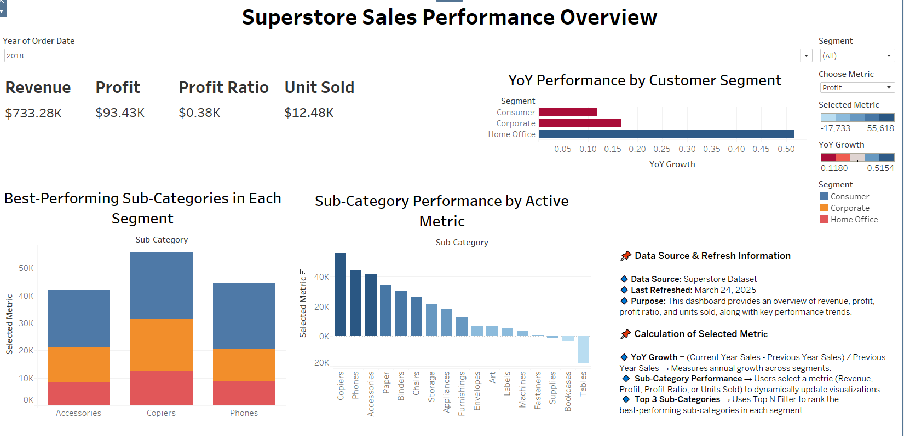
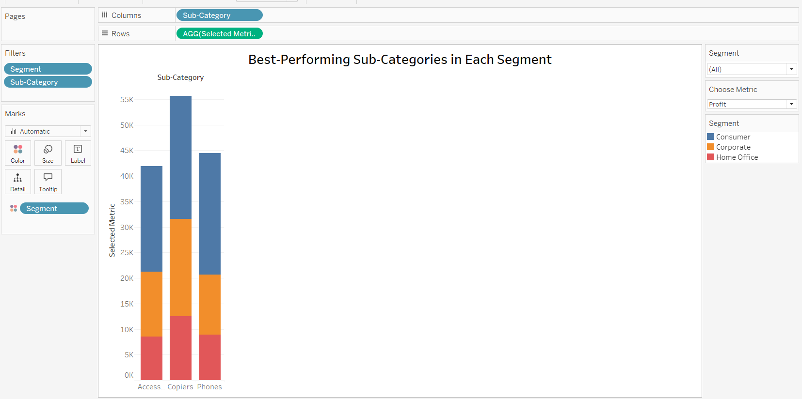
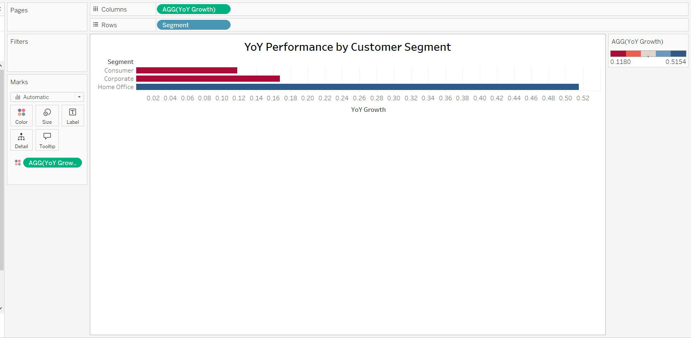
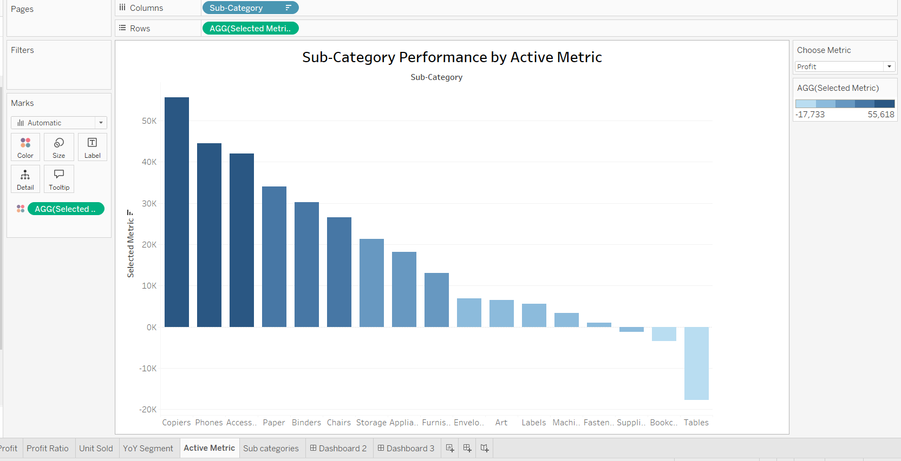

# 📈 Superstore Strategic Dashboard

An interactive Tableau dashboard analyzing the Superstore dataset, with full explanations embedded here.

---

## Table of Contents

1. [Project Overview](#project-overview)  
2. [Font Hierarchy Explanation](#font-hierarchy-explanation)  
3. [Explanation of Key Metrics](#explanation-of-key-metrics)  
4. [Dashboard Design Considerations](#dashboard-design-considerations)  
5. [Accessing the Dashboard](#accessing-the-dashboard)
6. [Summary of insights](#summary-of-insights)
---

## Project Overview

This dashboard provides strategic insights into the Superstore dataset. It highlights overall sales and profit performance, drills into sub-category trends, and compares customer segments—all built in Tableau.

---
### 🎨 Font Hierarchy Explanation

To ensure clarity, the following font sizes and weights are used:

- **Dashboard Title**  
  - Size: 24 pt, Bold  
  - Purpose: Clearly identifies the dashboard’s name; positioned at top center.  
- **KPI Metrics (BANs)**  
  - Size: 18 pt, Bold  
  - Purpose: Displays Revenue, Profit, Profit Ratio, and Units Sold prominently.  
- **Section Headings**  
  - Size: 16 pt, Bold  
  - Purpose: Labels major sections (e.g. Year‑over‑Year Performance).  
- **Body Text**  
  - Size: 14 pt, Regular  
  - Purpose: Descriptive text and context.  
- **Helper Text / Annotations**  
  - Size: 10 pt, Regular  
  - Purpose: Tooltips, calculation notes, and subtle guidance.

---
## 📷 Preview



---

## 🔢Explanation of Key Metrics

### Top‑Level KPIs (BANs)

- **Revenue**  
  - Calculation: `SUM([Sales])`  
  - Definition: Total dollar sales.  
- **Profit**  
  - Calculation: `SUM([Profit])`  
  - Definition: Net earnings after costs.  
- **Profit Ratio**  
  - Calculation: `SUM([Profit Ratio])`  
  - Definition: Profit as a percentage of sales.  
- **Units Sold**  
  - Calculation: `SUM([Quantity])`  
  - Definition: Total items sold.
 
### Calculated Metrics

- **Year‑over‑Year (YoY) Growth**  
  - Formula:  
    ```
    (Sales_current_year − Sales_previous_year) ÷ Sales_previous_year
    
    ```  
  - Use: Measures annual growth for segments and categories.

- **Sub‑Category Performance**  
  - Implementation: A parameter lets the user choose one metric (Revenue, Profit, Profit Ratio, or Units Sold).  
  - Effect: All charts update to show trends for that metric.
 
- **Top N Sub‑Categories**  
  - Filter: Tableau’s “Top N” filter set to the top 3 sub-categories by the selected metric, for each customer segment.  
  - Use: Focuses attention on the highest‑performing lines of business.

---

## Dashboard Design Considerations

### Alignment & Layout

- **Grid layout** for clear grouping of charts.  
- **BANs** at the top for instant executive overview.  
- **Interactive controls** (filters & parameters) on the left side for easy access.

### Use of Color

- **Blue** for positive growth (sales ↑, profit ↑).  
- **Red** for declines (profit ↓).  
- **Color‑blind‑friendly palette** throughout to ensure accessibility.

---

## Accessing the Dashboard

To interact with the live version, open it on Tableau Public: [Dashboard analysis](https://public.tableau.com/app/profile/daizy.asmani/viz/SalesDashboard2018_17428413187980/Dashboard3)

---

## Summary of Insights

### 📊 Insight 1: Best Performing Categories (Bar Plot)

This bar plot ranks the main product categories by total revenue. Office Supplies leads the pack, followed by Technology and Furniture, which together account for over 70% of overall sales.



### 📈 Insight 2: Sub‑Category Performance by Metric

An interactive chart lets users switch between KPIs (Revenue, Profit, Profit Ratio, Units Sold). For example, Technology emerges as the most profitable sub‑category by profit ratio, while Office Supplies dominates in units sold volume.



### 📆 Insight 3: YoY Performance by Customer Segment

Year‑over‑Year growth lines compare the Consumer, Corporate, and Home Office segments. The Consumer segment shows the strongest YoY increase (≈18% average), with all segments peaking during Q4 holiday seasons.



---
